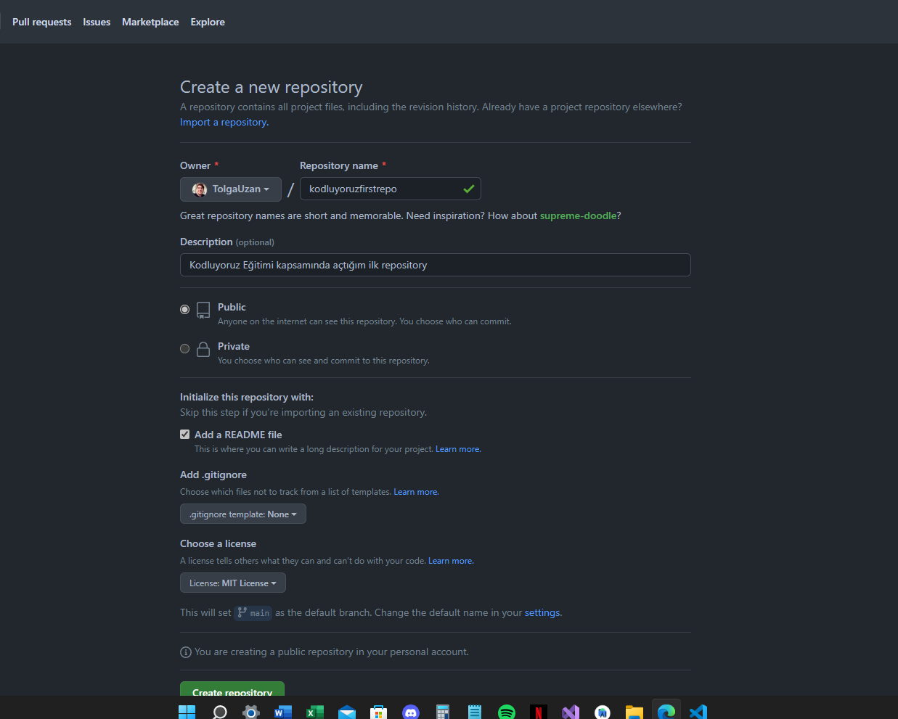

# Kodluyoruz Ilk Repository

Bu repo [Kodluyoruz](https://kodluyoruz.org) Front-End Eğitiminde oluşturduğumuz ilk repo. İçerisinde bir adet README dosyası, bir adet de index.html barındırıyor.



## Installation
---
Öncelikle projeyi clonelayın. 

```
# code 
git clone https://github.com/tolgauzan/kodluyoruzilkrepo.git
```
## Usage
---
Projeyi cloneladıktan sonra Visual Studio Code programında açınız.

Linux için:

```
# code 
cd kodluyoruzilkrepo
code .
```

## Contributing
---

Pull requestler kabul edilir. Büyük değişiklikler için, lütfen önce neyi değiştirmek istediğinizi tartışmak için bir konu açınız.

## License

[MIT](LICENSE)

---

 > **Author** : *Tolga Uzan*